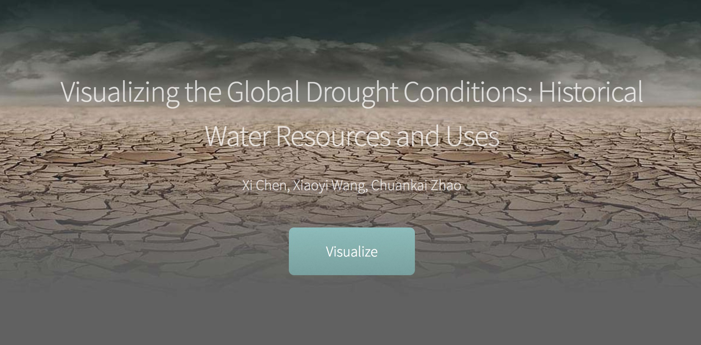
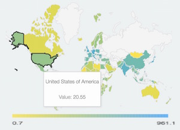
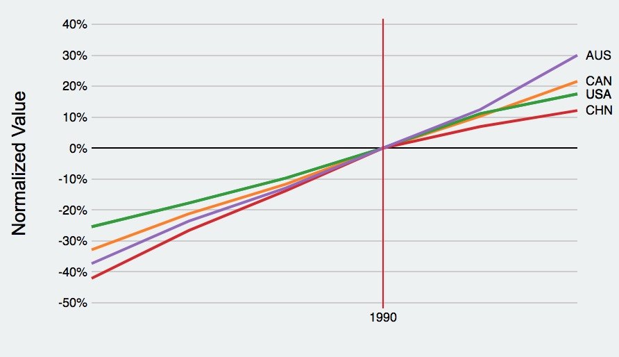
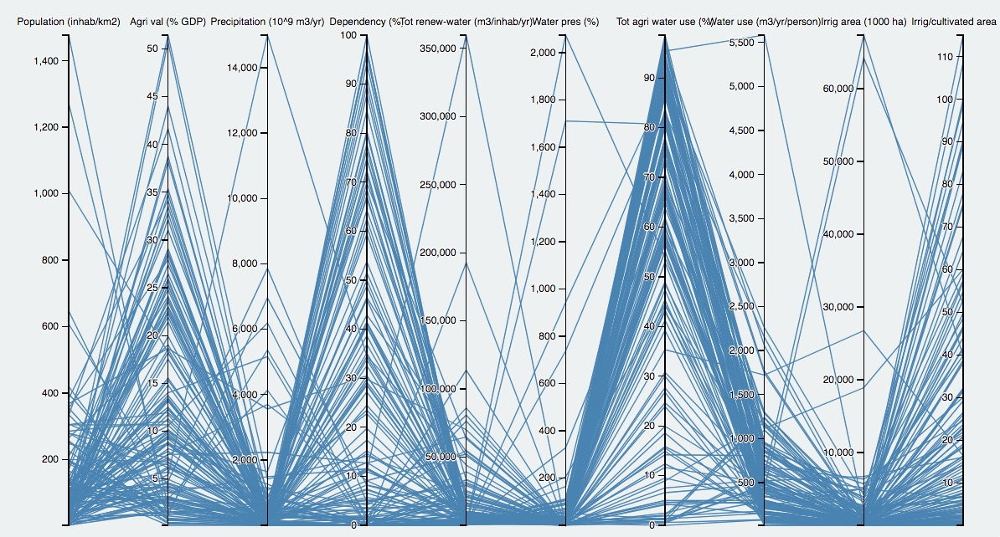

# Water Bank
This is a interative website offering visualization tools for the AQUASTAT global water information. </br>
It was implemented based on the responsive site template designed by [HTML5 UP](https://html5up.net/prologue).


## Data resource
We are using the AQUASTAT data for the implementation, the global water information system by the UN Food and Agriculture Organization. Data is available at http://www.fao.org/nr/water/aquastat/main/index.stm

## Project goals
* To visualize the water resources and uses across all the countries and regions in the world. 
* To visualize the historical changes of the water resources and uses to understand the origins and future of water scarcity in the world.
* To visualize the impact (causal relationship) of water shortage on the agriculture productivity and food security. 

## How to run this pipeline
* Fork and clone the repo
```
 git clone https://github.com/XICHEN24/Water_Bank.git
```
* Open the index.html with Chrome. You may encounter some UI oddities using other web browsers or mobiles to open the file.
* Check whether the browser has access to the the files under dataset.
* If the browser fails to display correctly, watch our the demo in the last section. 

## Implemented tools 
* World data map </br>



* Indexed line chart



* Parallel coordinate plot



## Demo
The demo shows how to visualize the water resource data using three visualization tools.

[](https://youtu.be/VhPRGqCxP7E)
